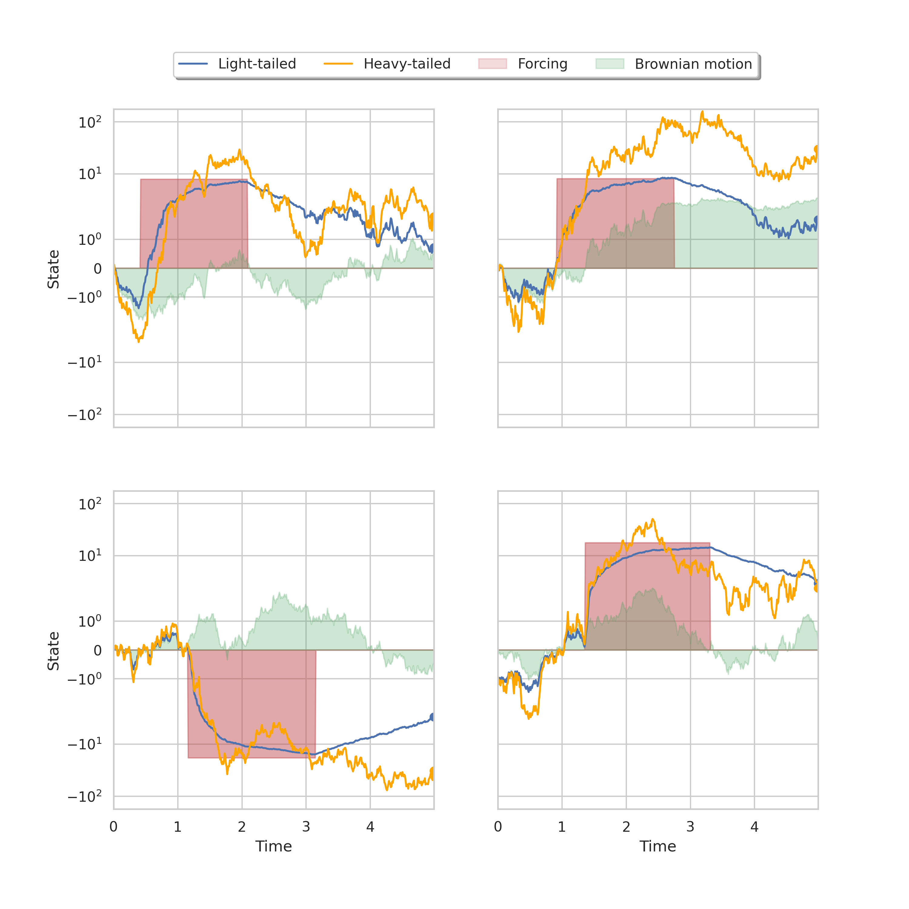

# Simple SDE datasets

This repository contains code for constructing datasets defined through simple SDEs.

There are two types of underlying diffusion structures, an Ornstein-Uhlenbeck formulation and a Student diffusion formulation.
These can be combined with forcing functions to produce either light-tailed or heavy-tailed temporal processes, like the one shown in this gif (see `make_gif.py` for details on this visualization):

The repository also contains code for simulated trajectories from stochastic versions of the Lorenz attractor and a stochastic Lotka-Volterra system.
Finally, there's an example of constructing a graph-structured heavy-tailed dataset.

The notebook `datasets.ipynb` showcases all the examples. 
### Installation

Install the environment. Note that this installs a GPU-enabled version of jax relying on cuda12.

### Code structure

Each example extends a `SimulatedSDEDatateset` class which contains the functionality for solving the SDEs under later-to-be-specific `drift` and `diffusion` functions. The solutions are numerical solutions obtained using [diffrax](https://docs.kidger.site/diffrax/).
For example, the `OrnsteinUhlenbeckDiffusionDataset` defines a `drift` and `diffusion` such that:

$$
\mathrm{d}X(t) = \mathrm{drift}\left(X_t, t\right) \mathrm{d}t + \mathrm{diffusion}\left(X_t, t\right) \mathrm{d}W_t,
$$

where $\mathrm{drift}\left(X_t, t\right) = - \theta (X_t - \mu)$ is a mean reverting drift function and $\mathrm{diffusion}\left(X_t, t\right) = \sigma$ is a constant diffusion independent of state and time.

The `StudentDiffusionDataset` modifies the diffusion function, such that:

$$
\mathrm{diffusion}\left(X_t, t \right) = \sqrt{\frac{2 \theta \delta^2}{\nu-1} \left(1 + \left(\frac{X_t - \mu}{\delta}\right)^2\right)}
$$

The forcing function examples use a mixin `ForcingMixin`, which adds a to-be-specified `forcing_function` to the super-class's drift. For instance, `SineForcingMixin` adds instantiations of a sine-function forcing function with randomly sampled amplitude, frequency and phase (these are constructed during the call to `get_initial_conditions`). 

